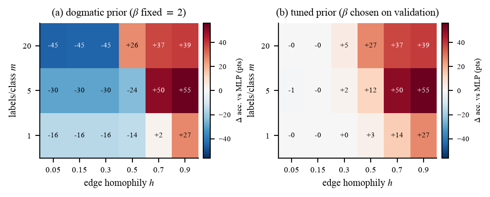

# When Does an Explicit Homophily Prior Help?

**Markov random fields, variational inference and MCMC for low-label node classification.**
CMPT 727 Statistical Machine Learning (Spring 2026), Simon Fraser University — Waleed Ahmed.

Graph neural networks are justified by a *homophily* assumption: nodes joined by an edge tend to
share a label. In a GCN that assumption is buried inside the architecture, so its contribution is
never measured on its own. This project takes the assumption out of the architecture, writes it
down as an explicit pairwise Markov random field over the labels, and measures — under a protocol
fixed before any experiment ran — when stating it explicitly actually helps.

**7,744 model runs · 11,280 exact-inference comparisons · 13 automated audit checks · CPU only.**

<p align="center">
  <br>
  <em>The same prior, imposed two ways. Left: coupling fixed in advance — it swings from −45 to
  +55 accuracy points depending only on the graph. Right: coupling chosen on validation data —
  the harm essentially disappears.</em>
</p>

## Three findings

1. **The prior's value tracks the quality of the evidence, not label scarcity.** Our
   pre-registered hypothesis — that an explicit prior helps most when labels are scarcest — was
   **refuted and reversed** (−7.07 accuracy points, 95% CI [−10.26, −3.91], *p* = 6.6×10⁻⁴; and
   more sharply under macro-F1). A Markov random field *propagates* label information; it does
   not create it, so when the unary evidence is near chance level there is nothing to propagate.
2. **Misspecification is dangerous only for a prior you commit to.** With the coupling fixed in
   advance, a wrong prior costs up to 45 points through **posterior collapse** (96.6% of edges
   end up predicting the same label; accuracy falls to chance). With the coupling tuned on
   validation data, the worst case is −0.5 points, because β → 0 nests the baseline.
3. **The popular Laplacian "logic" penalty is largely a generic regularizer.** Rewiring the graph
   to destroy label structure while preserving every node's degree makes the MRF's benefit vanish
   (as a relational method's should) — but the Laplacian penalty keeps most of its gain, which
   the algebra in Proposition 1 predicts: it carries a confidence-penalty term that acts
   regardless of what the graph says.

Full evidence and interpretation: [`docs/SCIENTIFIC_FINDINGS.md`](docs/SCIENTIFIC_FINDINGS.md).

## Repository layout

```
├── paper/            the conference-format report (compile-ready)
│   ├── final_report_WaleedAhmed_ICLR2026.tex   ← primary submission (ICLR 2026 format)
│   ├── report_cmpt727.tex                      ← course-report variant
│   ├── figures/                                figures (.pdf for LaTeX, .png for GitHub)
│   └── iclr2026_conference.{sty,bst,bib}, …    unmodified ICLR 2026 template files
├── src/              library: models, losses, MRF, inference engines, generators
│   ├── inference/    mean_field · loopy_bp · gibbs · exact (enumeration + variable elimination)
│   ├── models/       mlp · gcn
│   ├── synthetic/    contextual SBM generator · small graphs · oracles
│   └── analysis.py   selection, paired bootstrap CIs, Holm-corrected endpoints
├── experiments/      one runner per experiment block, plus analysis/figures/audit
├── configs/          one YAML per dataset
├── tests/            the pre-registered correctness gates
├── results/
│   ├── raw/          append-only run logs — the evidence behind every number (32 CSVs)
│   ├── processed/    analysis.json · audit.json
│   └── logs/         stdout of every run
├── tables/           T1–T7 (.csv and .tex)
├── docs/             proposal, playbook, research design, findings, manifest
├── PROTOCOL.md       the frozen pre-registration (git tag `protocol-freeze`)
└── CHANGELOG.md      every post-freeze amendment, with rationale
```

## Method in one paragraph

One backbone is held fixed and only the treatment of the prior varies. The same assumption is
imposed three ways: a **Laplacian penalty** on the training loss, an **expected rule-violation
(semantic) loss**, and an explicit **Potts MRF** over the labels,
*p*(y | X,G) ∝ exp[Σᵢ sᵢ(yᵢ) + β Σ₍ᵢ,ⱼ₎∈E **1**[yᵢ = yⱼ]], whose unary potentials are the
*frozen* network's logits. Because inference consumes frozen logits, every MRF variant sees
identical evidence, so differences are attributable to the prior and the inference rather than to
a differently fitted network. The posterior is computed by colour-blocked **mean-field**
(provably ELBO-monotone), audited with damped **loopy BP** and chromatic Rao-Blackwellized
**Gibbs** (R̂/ESS gated), and validated against **exact** marginals from enumeration and
variable elimination.

## Reproducing

```bash
python3 -m venv .venv
.venv/bin/pip install torch --index-url https://download.pytorch.org/whl/cpu
.venv/bin/pip install -r requirements.txt

.venv/bin/python -m pytest tests/ -q              # the pre-registered correctness gates
.venv/bin/python -m experiments.run_e0            # pipeline sanity gate
.venv/bin/python -m experiments.run_sigma_pilot   # freezes the generator's noise level
.venv/bin/python -m experiments.tune_stage1       # freezes backbone hyperparameters
```

Main experiment blocks (shard by writing to separate CSVs; analysis merges them):

```bash
for m in 1 2 5 10 20; do RUNS_CSV=results/raw/runs_cora_m$m.csv \
  .venv/bin/python -m experiments.run_real --dataset cora --seeds 0-9 --m $m & done; wait
for h in 0.05 0.15 0.30 0.50 0.70 0.90; do RUNS_CSV=results/raw/runs_sbm_h$h.csv \
  .venv/bin/python -m experiments.run_sbm --h $h --seeds 0-9 & done; wait
for s in chain tree star cycle grid grid7 dense budget; do \
  .venv/bin/python -m experiments.run_fidelity --structure $s --draws 20 & done; wait
for c in rewired deeper floor smallval checksum simcheck; do RUNS_CSV=results/raw/runs_ctrl_$c.csv \
  .venv/bin/python -m experiments.run_controls --control $c & done; wait

.venv/bin/python -m experiments.analyze            # tables + confirmatory verdicts
.venv/bin/python -m experiments.make_paper_figures # paper/figures/*.pdf
.venv/bin/python -m experiments.audit              # 13 validity checks
```

Roughly 7–9 hours wall-clock on a laptop CPU with the parallel sharding above. Datasets download
automatically (PyTorch Geometric Planetoid); synthetic graphs are generated from seeded code.

## Compiling the paper

Upload `paper/` to Overleaf, set the compiler to **pdfLaTeX**, and recompile **twice** (the first
pass writes the `.aux`; the second resolves citations and figure numbers). Overleaf names the
output after the main file, so it downloads as `final_report_WaleedAhmed_ICLR2026.pdf`. See
[`paper/README.md`](paper/README.md).

## Research integrity

- **Pre-registered.** Hypotheses, comparisons, grids, seeds and the analysis plan were
  version-controlled and git-tagged (`protocol-freeze`) *before* any experiment ran. The two
  later amendments are documented with rationale in `CHANGELOG.md`.
- **No hand-typed numbers.** Every value in the paper is generated by script from append-only run
  logs in `results/raw/`.
- **Selection cannot see the test set.** `src/analysis.py:select_tuned` reads only validation
  columns; a permutation test proves test labels cannot influence training.
- **Negative results reported.** The headline pre-registered hypothesis was refuted, and it is
  reported as such rather than replaced with a comparison that worked.

## Acknowledgements

Built on PyTorch, PyTorch Geometric (`GCNConv` and the Planetoid loaders), NetworkX (graph
colouring), SciPy, ArviZ (R̂ and ESS), NumPy, pandas and Matplotlib. All models and all four
inference engines were implemented for this project. Method sources are credited per component
in Table 1 of the paper.
